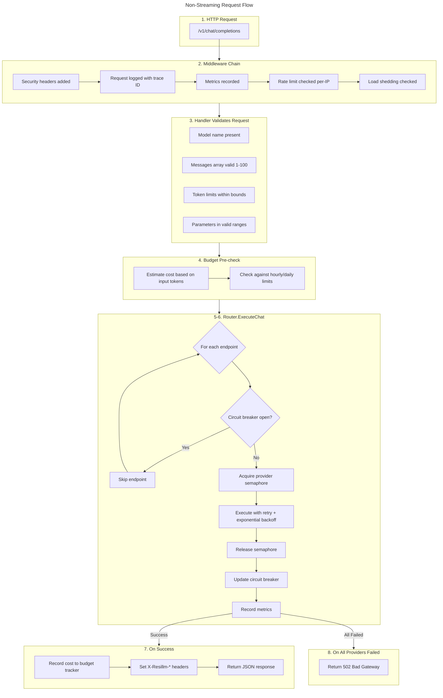
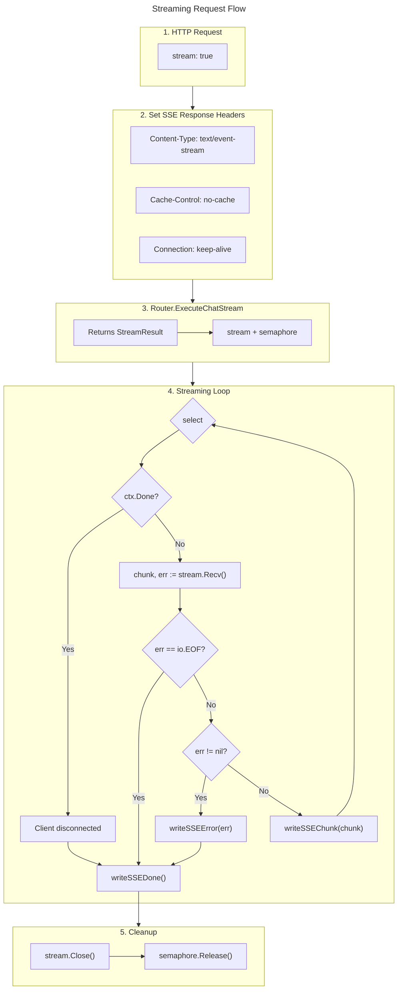

# resillm Internals Documentation

This document provides a comprehensive guide to the internal architecture, design decisions, and implementation details of resillm - a lightweight LLM resilience proxy.

---

## Table of Contents

1. [Architecture Overview](#architecture-overview)
2. [Project Structure](#project-structure)
3. [Package Reference](#package-reference)
4. [Request Flow](#request-flow)
5. [Provider Abstraction](#provider-abstraction)
6. [Resilience Patterns](#resilience-patterns)
7. [Configuration System](#configuration-system)
8. [Budget & Cost Tracking](#budget--cost-tracking)
9. [Metrics & Observability](#metrics--observability)
10. [Concurrency Model](#concurrency-model)
11. [Security](#security)
12. [Testing](#testing)
13. [Extension Points](#extension-points)

---

## Architecture Overview

resillm is designed as a transparent proxy that sits between your application and LLM providers. The core design principles are:

1. **Language Agnostic**: Uses standard OpenAI API format, compatible with any OpenAI SDK
2. **Zero Code Changes**: Drop-in replacement for direct provider calls
3. **Defense in Depth**: Multiple resilience layers (retry, circuit breaker, fallback)
4. **Observable**: Comprehensive metrics, logging, and tracing
5. **Cost-Aware**: Real-time budget tracking with enforcement

### High-Level Architecture

```
┌─────────────────┐     ┌─────────────────────────────────────────────────────┐
│                 │     │                      resillm                        │
│   Application   │────▶│  ┌─────────┐  ┌────────┐  ┌──────────┐             │
│   (any language)│     │  │ Handler │─▶│ Router │─▶│ Provider │─▶ OpenAI    │
│                 │◀────│  │         │  │        │  │ Registry │─▶ Anthropic │
└─────────────────┘     │  └─────────┘  └────────┘  └──────────┘─▶ Azure     │
                        │       │            │                                │
                        │       ▼            ▼                                │
                        │  ┌─────────┐  ┌─────────────┐                      │
                        │  │ Budget  │  │   Circuit   │                      │
                        │  │ Tracker │  │   Breaker   │                      │
                        │  └─────────┘  └─────────────┘                      │
                        └─────────────────────────────────────────────────────┘
```

---

## Project Structure

```
resillm/
├── cmd/resillm/              # Application entry point
│   └── main.go               # Bootstrap, signal handling, graceful shutdown
│
├── internal/                 # Core application packages
│   ├── budget/               # Cost tracking and enforcement
│   │   └── tracker.go        # Rolling window budget tracker
│   │
│   ├── config/               # Configuration management
│   │   ├── config.go         # Config structs and loading
│   │   └── watcher.go        # Hot-reload via fsnotify
│   │
│   ├── metrics/              # Prometheus metrics
│   │   └── collector.go      # Metric definitions and collection
│   │
│   ├── pricing/              # Cost calculation
│   │   └── calculator.go     # Per-model pricing tables
│   │
│   ├── providers/            # LLM provider integration
│   │   ├── provider.go       # Provider interface and registry
│   │   ├── goopenai.go       # Unified go-openai based provider
│   │   └── semaphore.go      # Per-provider concurrency control
│   │
│   ├── resilience/           # Fault tolerance patterns
│   │   ├── circuitbreaker.go # Circuit breaker implementation
│   │   └── retry.go          # Retry with exponential backoff
│   │
│   ├── router/               # Request routing
│   │   └── router.go         # Routing with fallback chains
│   │
│   ├── server/               # HTTP server
│   │   ├── server.go         # Server setup and middleware
│   │   ├── handlers.go       # Request handlers
│   │   ├── ratelimit.go      # Sharded rate limiter
│   │   └── loadshed.go       # Load shedding
│   │
│   └── types/                # Shared types
│       └── types.go          # ExecutionMeta, ErrorResponse
│
├── config.yaml               # Default configuration
├── go.mod                    # Go module definition
└── README.md                 # User documentation
```

---

## Package Reference

### `cmd/resillm`

The application entry point responsible for:

- Parsing command-line flags (`-config` for config path)
- Setting up structured logging with zerolog
- Loading and validating configuration
- Creating the server and starting it
- Handling graceful shutdown on SIGINT/SIGTERM

```go
// Key initialization sequence
cfg := config.LoadConfig(configPath)
server := server.New(cfg, configPath)
server.Start()
// Wait for shutdown signal
server.Shutdown(ctx)
```

### `internal/server`

The HTTP server package manages all incoming requests.

**Key Types:**

```go
type Server struct {
    cfg      *config.Config
    cfgPath  string
    router   *router.Router
    metrics  *metrics.Collector
    budget   *budget.Tracker
    startTime time.Time
}
```

**Endpoints:**

| Endpoint               | Method | Description                                   |
| ---------------------- | ------ | --------------------------------------------- |
| `/v1/chat/completions` | POST   | Chat completion (streaming and non-streaming) |
| `/v1/completions`      | POST   | Legacy completions (not implemented)          |
| `/v1/embeddings`       | POST   | Embeddings (not implemented)                  |
| `/health`              | GET    | Health check                                  |
| `/v1/providers`        | GET    | Provider status                               |
| `/v1/budget`           | GET    | Budget status                                 |
| `/admin/reload`        | POST   | Hot-reload configuration                      |
| `/metrics`             | GET    | Prometheus metrics (separate port)            |

**Middleware Chain:**

```go
// Applied in order:
1. securityHeadersMiddleware  // XSS, clickjacking protection
2. loggingMiddleware          // Request tracing
3. metricsMiddleware          // HTTP metrics
4. rateLimitMiddleware        // Per-IP rate limiting
5. loadSheddingMiddleware     // Overload protection
```

### `internal/router`

The router handles request routing with fallback support.

**Key Types:**

```go
type Router struct {
    models          map[string]config.ModelConfig
    providers       ProviderRegistry
    circuitBreakers map[string]*resilience.CircuitBreaker
    retryConfig     config.RetryConfig
    metrics         *metrics.Collector
    semaphores      *providers.ProviderSemaphores
}

type StreamResult struct {
    Stream   providers.ChatStream
    Sem      *providers.Semaphore
    Provider string
}
```

**Key Methods:**

- `ExecuteChat(ctx, req)` - Non-streaming request routing
- `ExecuteChatStream(ctx, req)` - Streaming request routing
- `GetProviderStatus()` - Health status of all providers
- `UpdateModels(models)` - Hot-reload model configuration

### `internal/providers`

The provider package defines the abstraction layer for LLM providers.

**Core Interface:**

```go
type Provider interface {
    Name() string
    ExecuteChat(ctx context.Context, req openai.ChatCompletionRequest, model string) (openai.ChatCompletionResponse, error)
    ExecuteChatStream(ctx context.Context, req openai.ChatCompletionRequest, model string) (ChatStream, error)
    CalculateCost(model string, usage openai.Usage) float64
    HealthCheck(ctx context.Context) error
}

type ChatStream interface {
    Recv() (openai.ChatCompletionStreamResponse, error)
    Close()
}
```

**Provider Registry:**

```go
type Registry struct {
    providers map[string]Provider
}

func (r *Registry) Get(name string) (Provider, bool)
func (r *Registry) List() []string
```

**GoOpenAIProvider:**

A unified provider implementation using the `sashabaranov/go-openai` library that supports:

- OpenAI (native)
- Anthropic (via OpenAI-compatible API)
- Azure OpenAI
- Ollama (local models)

### `internal/resilience`

Implements fault tolerance patterns.

**Circuit Breaker:**

```go
type CircuitBreaker struct {
    name             string
    state            State  // Closed, Open, HalfOpen
    failures         int64
    successes        int64
    lastFailure      time.Time
    failureThreshold int
    successThreshold int
    timeout          time.Duration
}

// State transitions:
// Closed -> Open: After failureThreshold consecutive failures
// Open -> HalfOpen: After timeout duration
// HalfOpen -> Closed: After successThreshold successes
// HalfOpen -> Open: On first failure
```

**Retrier:**

```go
type Retrier struct {
    maxAttempts       int
    initialBackoff    time.Duration
    maxBackoff        time.Duration
    backoffMultiplier float64
    retryableErrors   []int
}

// Exponential backoff with jitter:
// backoff = min(initial * multiplier^attempt, max) * (1 ± 0.25)
```

### `internal/budget`

Tracks and enforces cost budgets using rolling time windows.

**Key Types:**

```go
type Tracker struct {
    hourlyWindow *RollingWindow  // 60 x 1-minute buckets
    dailyWindow  *RollingWindow  // 24 x 1-hour buckets
    config       Config
}

type CheckResult struct {
    Allowed        bool
    Warning        bool
    Message        string
    RemainingHour  float64
    RemainingDay   float64
}
```

**Key Methods:**

- `Check(estimatedCost)` - Pre-request budget validation
- `Record(actualCost)` - Post-request cost recording
- `Status()` - Current budget status for API

### `internal/pricing`

Calculates request costs based on token usage.

```go
type Calculator struct {
    prices         map[string]ModelPricing
    defaultPricing ModelPricing
}

type ModelPricing struct {
    InputPer1M  float64  // Cost per 1M input tokens
    OutputPer1M float64  // Cost per 1M output tokens
}

// Cost formula:
// (prompt_tokens / 1M * InputPer1M) + (completion_tokens / 1M * OutputPer1M)
```

**Pre-configured Models:**

| Model             | Input/1M | Output/1M |
| ----------------- | -------- | --------- |
| gpt-4o            | $2.50    | $10.00    |
| gpt-4o-mini       | $0.15    | $0.60     |
| gpt-4-turbo       | $10.00   | $30.00    |
| claude-3.5-sonnet | $3.00    | $15.00    |
| claude-3-opus     | $15.00   | $75.00    |

### `internal/metrics`

Prometheus metrics collection and reporting.

**Metrics Collected:**

| Metric                            | Type      | Labels                  | Description     |
| --------------------------------- | --------- | ----------------------- | --------------- |
| `resillm_requests_total`          | Counter   | provider, model, status | Total requests  |
| `resillm_request_latency_seconds` | Histogram | provider                | Request latency |
| `resillm_tokens_total`            | Counter   | provider, model, type   | Token usage     |
| `resillm_cost_dollars_total`      | Counter   | provider, model         | Total cost      |
| `resillm_errors_total`            | Counter   | provider, error_type    | Error count     |
| `resillm_circuit_state`           | Gauge     | provider                | Circuit state   |
| `resillm_fallbacks_total`         | Counter   | from, to                | Fallback usage  |

### `internal/config`

Configuration loading, validation, and hot-reload.

**Key Features:**

- YAML configuration with sensible defaults
- Environment variable expansion (`${VAR}` syntax)
- Validation of unexpanded variables in secrets
- File system watching for hot-reload
- Configuration diffing for selective updates

---

## Request Flow

### Non-Streaming Request

```
1. HTTP Request arrives at /v1/chat/completions
   │
2. Middleware chain processes request
   │ ├─ Security headers added
   │ ├─ Request logged with trace ID
   │ ├─ Metrics recorded
   │ ├─ Rate limit checked (per-IP)
   │ └─ Load shedding checked
   │
3. Handler validates request
   │ ├─ Model name present
   │ ├─ Messages array valid (1-100 messages)
   │ ├─ Token limits within bounds
   │ └─ Parameters in valid ranges
   │
4. Budget pre-check
   │ ├─ Estimate cost based on input tokens
   │ └─ Check against hourly/daily limits
   │
5. Router.ExecuteChat() called
   │
6. For each endpoint in chain (primary + fallbacks):
   │ ├─ Check circuit breaker state
   │ │   └─ Skip if circuit is open
   │ ├─ Acquire provider semaphore
   │ ├─ Execute with retry
   │ │   └─ Retry loop with exponential backoff
   │ ├─ Release semaphore
   │ ├─ Update circuit breaker (success/failure)
   │ └─ Record metrics
   │
7. On success:
   │ ├─ Record cost to budget tracker
   │ ├─ Set response headers (X-Resillm-*)
   │ └─ Return JSON response
   │
8. On all providers failed:
   └─ Return 502 Bad Gateway with error details
```



### Streaming Request

```
1. HTTP Request with stream: true
   │
2. Set SSE response headers
   │ ├─ Content-Type: text/event-stream
   │ ├─ Cache-Control: no-cache
   │ └─ Connection: keep-alive
   │
3. Router.ExecuteChatStream() called
   │ └─ Returns StreamResult (stream + semaphore)
   │
4. Streaming loop:
   │ for {
   │     select {
   │     case <-ctx.Done():
   │         // Client disconnected
   │         writeSSEDone()
   │         return
   │     default:
   │         chunk, err := stream.Recv()
   │         if err == io.EOF {
   │             writeSSEDone()
   │             return
   │         }
   │         if err != nil {
   │             writeSSEError(err)
   │             writeSSEDone()
   │             return
   │         }
   │         writeSSEChunk(chunk)
   │     }
   │ }
   │
5. Cleanup:
   ├─ stream.Close()
   └─ semaphore.Release()
```



---

## Provider Abstraction

### Unified Provider Model

resillm uses `sashabaranov/go-openai` as a unified transport layer. This library supports multiple LLM providers through OpenAI-compatible APIs.

```go
// Provider creation based on name
func NewGoOpenAIProvider(name string, cfg config.ProviderConfig) (*GoOpenAIProvider, error) {
    switch name {
    case "openai":
        clientConfig = openai.DefaultConfig(cfg.APIKey)
    case "anthropic":
        clientConfig = openai.DefaultAnthropicConfig(cfg.APIKey, baseURL)
    case "azure", "azure-openai":
        clientConfig = openai.DefaultAzureConfig(cfg.APIKey, cfg.BaseURL)
    }
    return &GoOpenAIProvider{
        client:     openai.NewClientWithConfig(clientConfig),
        calculator: pricing.NewCalculator(),
    }
}
```

### Error Handling

Provider errors are wrapped in a structured type that supports retry classification:

```go
type ProviderError struct {
    Code     int    // HTTP status code
    Body     string // Error message
    Provider string // Provider name
}

func (e *ProviderError) StatusCode() int { return e.Code }

func (e *ProviderError) IsRetryable() bool {
    // Retry on rate limits and server errors
    return e.Code == 429 || e.Code >= 500
}
```

### Adding New Providers

To add a new provider:

1. If OpenAI-compatible, add case to `NewGoOpenAIProvider`
2. If custom protocol, implement the `Provider` interface
3. Add pricing data to `pricing.Calculator`
4. Register in configuration schema

---

## Resilience Patterns

### Circuit Breaker

The circuit breaker prevents cascading failures by temporarily stopping requests to failing providers.

**State Machine:**

```
        ┌──────────────┐
        │    Closed    │ ◀─── Normal operation
        │ (all calls)  │
        └──────┬───────┘
               │ N consecutive failures
               ▼
        ┌──────────────┐
        │     Open     │ ◀─── Fast fail all requests
        │ (reject all) │
        └──────┬───────┘
               │ timeout expires
               ▼
        ┌──────────────┐
        │  Half-Open   │ ◀─── Testing recovery
        │ (limited)    │
        └──────┬───────┘
               │
      ┌────────┴────────┐
      │ M successes     │ 1 failure
      ▼                 ▼
   Closed             Open
```

**Configuration:**

```yaml
resilience:
  circuit_breaker:
    failure_threshold: 5 # Failures to open circuit
    success_threshold: 3 # Successes to close circuit
    timeout: 30s # Time before half-open
    half_open_max_requests: 50
```

### Retry with Exponential Backoff

Retries transient failures with increasing delays to avoid thundering herd.

**Algorithm:**

```
attempt = 0
while attempt < max_attempts:
    result = execute_request()
    if success:
        return result

    if not is_retryable(error):
        return error

    # Calculate backoff with jitter
    backoff = initial * (multiplier ^ attempt)
    backoff = min(backoff, max_backoff)
    jitter = backoff * 0.25 * random(-1, 1)
    backoff = max(backoff + jitter, initial)

    sleep(backoff)
    attempt++
```

**Configuration:**

```yaml
resilience:
  retry:
    max_attempts: 3
    initial_backoff: 100ms
    max_backoff: 10s
    backoff_multiplier: 2.0
    retryable_errors: [429, 500, 502, 503, 504]
```

### Fallback Chains

When a provider fails, the router automatically tries the next provider in the fallback chain.

```yaml
models:
  gpt-4o:
    primary:
      provider: openai
      model: gpt-4o
    fallbacks:
      - provider: anthropic
        model: claude-sonnet-4-20250514
      - provider: azure-openai
        model: gpt-4o
```

**Execution order:**

1. Try OpenAI gpt-4o
2. If failed after retries, try Anthropic claude-sonnet-4
3. If failed after retries, try Azure OpenAI gpt-4o
4. If all fail, return error to client

---

## Configuration System

### Configuration Structure

```yaml
server:
  host: "0.0.0.0"
  port: 8080
  metrics_port: 9090
  admin_api_key: ${RESILLM_ADMIN_KEY}
  rate_limit:
    enabled: true
    requests_per_second: 10
    burst: 20
  load_shedding:
    enabled: true
    max_active_requests: 1000
    max_connections_per_ip: 100

providers:
  openai:
    api_key: ${OPENAI_API_KEY}
  anthropic:
    api_key: ${ANTHROPIC_API_KEY}

models:
  gpt-4o:
    primary:
      provider: openai
      model: gpt-4o
    fallbacks:
      - provider: anthropic
        model: claude-sonnet-4-20250514

resilience:
  retry:
    max_attempts: 3
    initial_backoff: 100ms
    max_backoff: 10s
  circuit_breaker:
    failure_threshold: 5
    success_threshold: 3
    timeout: 30s

budget:
  enabled: true
  max_cost_per_hour: 10.00
  max_cost_per_day: 100.00
  alert_threshold: 0.8
  action_on_exceeded: reject

logging:
  level: info
  format: json
  log_requests: true
```

### Environment Variable Expansion

Configuration supports `${VAR}` syntax for environment variables:

```yaml
providers:
  openai:
    api_key: ${OPENAI_API_KEY} # Expanded at load time
```

The loader validates that all variables are expanded, preventing accidental secret exposure in config files.

### Hot-Reload

Configuration changes are automatically detected and applied without restart:

```go
// File watcher setup
watcher.Add(configDir)

// On change (debounced 500ms):
newConfig := config.LoadConfig(path)
diff := config.DiffConfigs(oldConfig, newConfig)
applyChanges(diff)
```

**Hot-reloadable sections:**

- Models (routing and fallbacks)
- Resilience settings
- Budget settings
- Logging settings

**Requires restart:**

- Provider API keys
- Server port
- Metrics port

---

## Budget & Cost Tracking

### Rolling Window Design

Budget tracking uses rolling time windows to enforce limits:

```
Hourly Window (60 buckets of 1 minute each):
┌───┬───┬───┬───┬───┬───┬───┬───┬───┬───┐
│ 0 │ 1 │ 2 │...│57 │58 │59 │ 0 │ 1 │...│
└───┴───┴───┴───┴───┴───┴───┴───┴───┴───┘
                            ▲
                        current

Daily Window (24 buckets of 1 hour each):
┌───┬───┬───┬───┬───┬───┬───┬───┐
│ 0 │ 1 │ 2 │...│22 │23 │ 0 │...│
└───┴───┴───┴───┴───┴───┴───┴───┘
```

### Pre-Request Check

Before processing a request, the budget tracker validates:

```go
result := budget.Check(estimatedCost)
if !result.Allowed {
    if cfg.ActionOnExceeded == "reject" {
        return 429, "budget_exceeded"
    }
    // allow_with_warning: set header, continue
    w.Header().Set("X-Resillm-Budget-Warning", result.Message)
}
```

### Cost Recording

After successful requests, actual cost is recorded:

```go
cost := provider.CalculateCost(model, usage)
budget.Record(cost)
metrics.RecordCost(provider, model, cost)
```

---

## Metrics & Observability

### Prometheus Metrics

resillm exposes comprehensive metrics on a separate port (default: 9090).

**Request Metrics:**

```
resillm_requests_total{provider="openai",model="gpt-4o",status="success"} 1234
resillm_request_latency_seconds_bucket{provider="openai",le="1.0"} 1000
resillm_requests_in_flight{} 5
```

**Token Metrics:**

```
resillm_tokens_total{provider="openai",model="gpt-4o",type="input"} 500000
resillm_tokens_total{provider="openai",model="gpt-4o",type="output"} 100000
```

**Cost Metrics:**

```
resillm_cost_dollars_total{provider="openai",model="gpt-4o"} 12.50
```

**Circuit Breaker Metrics:**

```
resillm_circuit_state{provider="openai"} 0  # 0=closed, 1=open, 2=half-open
resillm_circuit_failures_total{provider="openai"} 3
resillm_circuit_state_changes_total{provider="openai",from="closed",to="open"} 1
```

### Response Headers

Every response includes metadata headers:

| Header                 | Description                   |
| ---------------------- | ----------------------------- |
| `X-Request-ID`         | Unique request identifier     |
| `X-Resillm-Provider`   | Provider that handled request |
| `X-Resillm-Model`      | Actual model used             |
| `X-Resillm-Latency-Ms` | Request latency               |
| `X-Resillm-Cost`       | Cost in USD                   |
| `X-Resillm-Retries`    | Number of retries             |
| `X-Resillm-Fallback`   | Whether fallback was used     |

### Structured Logging

All logs are structured JSON (configurable to text):

```json
{
  "level": "info",
  "request_id": "abc123",
  "model": "gpt-4o",
  "provider": "openai",
  "cost_usd": 0.0025,
  "latency_ms": 1234,
  "prompt_tokens": 100,
  "completion_tokens": 50,
  "time": "2024-01-15T10:30:00Z",
  "message": "Request completed"
}
```

---

## Concurrency Model

### Synchronization Primitives

| Component             | Primitive       | Purpose                       |
| --------------------- | --------------- | ----------------------------- |
| Router models         | RWMutex         | Hot-reload safety             |
| Circuit breaker state | Mutex + atomics | State transitions             |
| Metrics counters      | atomic.Int64    | Lock-free updates             |
| Rate limiter          | Sharded RWMutex | Per-IP limits with 256 shards |
| Provider concurrency  | Semaphore       | Request limiting              |

### Provider Semaphores

Each provider has a semaphore limiting concurrent requests:

```go
type Semaphore struct {
    ch     chan struct{}  // Buffered channel as semaphore
    name   string
    active int64
}

// Acquire blocks until slot available or context cancelled
func (s *Semaphore) Acquire(ctx context.Context) error {
    select {
    case s.ch <- struct{}{}:
        atomic.AddInt64(&s.active, 1)
        return nil
    case <-ctx.Done():
        return ctx.Err()
    }
}

// Release returns slot to pool
func (s *Semaphore) Release() {
    select {
    case <-s.ch:
        atomic.AddInt64(&s.active, -1)
    default:
        // Log warning - possible double release
    }
}
```

### Sharded Rate Limiter

The rate limiter uses 256 shards to reduce lock contention:

```go
type ShardedRateLimiter struct {
    shards [256]struct {
        mu       sync.RWMutex
        limiters map[string]*rate.Limiter
    }
}

func (s *ShardedRateLimiter) getShard(ip string) int {
    h := fnv.New32a()
    h.Write([]byte(ip))
    return int(h.Sum32() % 256)
}
```

---

## Security

### Input Validation

All requests are validated:

| Field        | Validation                           |
| ------------ | ------------------------------------ |
| Model        | Required, must be configured         |
| Messages     | Required, 1-100 items, 32KB max each |
| Max tokens   | 0-100,000                            |
| Temperature  | 0.0-2.0                              |
| Top P        | 0.0-1.0                              |
| Request body | 5MB maximum                          |

### Security Headers

All responses include:

```
X-Content-Type-Options: nosniff
X-Frame-Options: DENY
X-XSS-Protection: 1; mode=block
Cache-Control: no-store
```

### Configuration Security

- Environment variable expansion for secrets
- Validation against unexpanded variables
- Warning on insecure config file permissions
- Admin API key for sensitive endpoints

---

## Testing

### Test Structure

```
internal/
├── budget/
│   └── tracker_test.go       # Budget window tests
├── config/
│   └── config_test.go        # Config loading/validation
├── resilience/
│   └── circuitbreaker_test.go
│   └── retry_test.go
├── router/
│   └── router_test.go        # Routing, fallback, concurrency
└── server/
    └── handlers_test.go      # HTTP handler tests
```

### Mock Infrastructure

```go
// MockProvider for testing
type MockProvider struct {
    name      string
    response  openai.ChatCompletionResponse
    err       error
    callCount int
    mu        sync.Mutex
    latency   time.Duration
    failUntil int
}

// MockChatStream for streaming tests
type MockChatStream struct {
    chunks []openai.ChatCompletionStreamResponse
    index  int
    err    error
    mu     sync.Mutex
}

// MockRegistry for isolated router tests
type MockRegistry struct {
    providers map[string]providers.Provider
}
```

### Running Tests

```bash
# All tests
go test ./...

# With race detector
go test ./... -race

# With coverage
go test ./... -cover

# Specific package
go test ./internal/router/... -v
```

---

## Extension Points

### Adding a New Provider

1. **OpenAI-compatible provider:**

   ```go
   // In goopenai.go NewGoOpenAIProvider()
   case "new-provider":
       clientConfig = openai.DefaultConfig(cfg.APIKey)
       clientConfig.BaseURL = cfg.BaseURL
   ```

2. **Custom protocol provider:**

   ```go
   // Implement Provider interface
   type CustomProvider struct { ... }

   func (p *CustomProvider) ExecuteChat(...) { ... }
   func (p *CustomProvider) ExecuteChatStream(...) { ... }
   ```

3. **Register in config:**
   ```yaml
   providers:
     new-provider:
       api_key: ${NEW_PROVIDER_KEY}
       base_url: "https://api.new-provider.com/v1"
   ```

### Adding Custom Metrics

```go
// In metrics/collector.go
var customMetric = prometheus.NewCounterVec(
    prometheus.CounterOpts{
        Name: "resillm_custom_metric",
        Help: "Description",
    },
    []string{"label1", "label2"},
)

func init() {
    prometheus.MustRegister(customMetric)
}
```

### Adding New Endpoints

```go
// In server/server.go setupRoutes()
mux.HandleFunc("/v1/new-endpoint", s.handleNewEndpoint)

// In server/handlers.go
func (s *Server) handleNewEndpoint(w http.ResponseWriter, r *http.Request) {
    // Implementation
}
```

### Custom Retry Logic

```go
// Implement RetryableError interface
type CustomError struct {
    Code    int
    Message string
}

func (e *CustomError) IsRetryable() bool {
    // Custom retry logic
    return e.Code == 503 || strings.Contains(e.Message, "temporary")
}
```

---

## Appendix: Key Interfaces

```go
// Provider interface - implement for new LLM providers
type Provider interface {
    Name() string
    ExecuteChat(ctx context.Context, req openai.ChatCompletionRequest, model string) (openai.ChatCompletionResponse, error)
    ExecuteChatStream(ctx context.Context, req openai.ChatCompletionRequest, model string) (ChatStream, error)
    CalculateCost(model string, usage openai.Usage) float64
    HealthCheck(ctx context.Context) error
}

// ChatStream interface - abstracts streaming responses
type ChatStream interface {
    Recv() (openai.ChatCompletionStreamResponse, error)
    Close()
}

// ProviderRegistry interface - provider lookup
type ProviderRegistry interface {
    Get(name string) (Provider, bool)
    List() []string
}

// RetryableError interface - error classification for retry
type RetryableError interface {
    IsRetryable() bool
}

// ProviderError interface - errors with HTTP status
type ProviderError interface {
    StatusCode() int
}
```

---

## Version History

| Version | Changes                             |
| ------- | ----------------------------------- |
| 1.0     | Initial release with OpenAI support |
| 1.1     | Added Anthropic and Azure support   |
| 1.2     | Circuit breaker and retry patterns  |
| 1.3     | Budget tracking and enforcement     |
| 1.4     | Streaming support with SSE          |
| 1.5     | Hot-reload configuration            |
| 2.0     | Refactored to use go-openai library |
